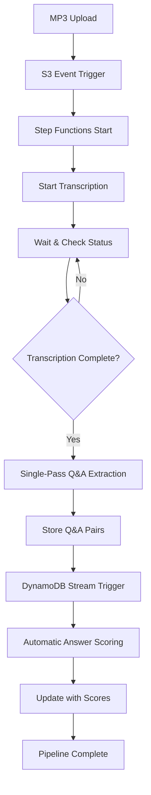

# 🎤 AI-Powered Interview Analysis Pipeline

A sophisticated serverless application that automatically processes interview recordings, extracts Q&A pairs, and scores candidate responses against job requirements using advanced AI models.

## 🚀 Overview

This AWS CDK-based application creates an end-to-end pipeline for analyzing technical interviews in English language. Upload an MP3 recording and get structured insights about the candidate's performance with automatic scoring.

### ✨ Key Features

- **🎧 Audio Transcription**: High-quality English language transcription with speaker identification
- **🤖 AI-Powered Q&A Extraction**: Uses Amazon Bedrock (Claude 4 Sonnet) for single-pass Q&A extraction
- **⚡ Real-time Scoring**: Event-driven automatic answer scoring against vacancy requirements
- **🎯 Smart Processing**: Single-pass processing handles 1-hour interviews without chunking
- **🔒 Enterprise Security**: End-to-end encryption with AWS KMS
- **💰 Optimized Performance**: Claude 4 Sonnet with 200k context for superior accuracy

## 🏗️ Architecture

```
┌─────────────┐    ┌──────────────┐    ┌─────────────────┐    ┌──────────────┐
│ S3 Upload   │───▶│ Step Functions│───▶│ Amazon Transcribe│───▶│ Claude 4     │
│ MP3 Files   │    │ Orchestration │    │ (English)       │    │ Q&A Extract  │
└─────────────┘    └──────────────┘    └─────────────────┘    └──────────────┘
                           │                                           │
                           ▼                                           ▼
                   ┌──────────────┐    ┌───────────────────┐   ┌──────────────┐
                   │ DynamoDB     │◀───│ DynamoDB Stream   │◀──│ Event-Driven │
                   │ Q&A Storage  │    │ Triggers          │   │ Scoring      │
                   └──────────────┘    └───────────────────┘   └──────────────┘
```

### 🧩 Components

- **S3 Bucket**: Stores interview recordings and vacancy descriptions
- **AWS Transcribe**: Converts English audio to text with speaker identification
- **Step Functions**: Orchestrates the main workflow (transcription → extraction)
- **Lambda Functions**: Process transcripts, extract Q&A, and score responses
- **DynamoDB**: Stores structured interview data with automatic scoring
- **DynamoDB Streams**: Triggers real-time answer scoring
- **Amazon Bedrock**: Claude 4 Sonnet for Q&A extraction and scoring

## 📁 Project Structure

```
├── src/functions/          # Lambda function implementations
│   ├── transcribe_processor/    # Audio transcription (English)
│   ├── qa_extractor/           # Single-pass Q&A extraction
│   └── answer_scorer/          # Real-time answer scoring
├── stacks/                 # CDK infrastructure definitions
│   ├── kms_stack.py           # Encryption keys
│   ├── s3_interview.py        # Storage buckets
│   ├── dynamodb_stack.py      # Database tables with streams
│   └── step_functions_stack.py # Workflow orchestration
└── utils/                  # Shared utilities and configuration
```

## 🎯 Use Cases

- **Technical Interviews**: Analyze coding and system design discussions
- **HR Screening**: Extract key competencies and responses with automated scoring
- **Interview Training**: Review and improve interviewing techniques
- **Performance Analytics**: Track candidate performance across multiple interviews
- **Compliance**: Maintain structured records with objective scoring

## 🛠️ Quick Start

### Prerequisites

- AWS Account with Bedrock access (Claude 4 Sonnet)
- Python 3.12+
- Poetry for dependency management
- AWS CDK v2

### Installation

```shell
# Clone and setup
git clone <repository>
cd workshop-serverless-applications-for-ai

# Install dependencies
poetry install

# Configure environment
export CDK_ACCOUNT=your-aws-account-id
export CDK_REGION=us-east-1
export CLOUD_ENVIRONMENT=workshop-dev

# Deploy infrastructure
cdk bootstrap --profile your-aws-profile
cdk deploy --all --profile your-aws-profile
```

## 📝 Usage

### 1. Prepare Interview Materials

```shell
# Upload vacancy description
aws s3 cp vacancy.txt s3://interview-artifacts/python-senior/vacancy.txt

# Upload interview recording
aws s3 cp interview.mp3 s3://interview-artifacts/python-senior/interview-123.mp3
```

### 2. Processing Pipeline

The system automatically:
1. **Detects** new MP3 uploads via S3 events
2. **Transcribes** audio using AWS Transcribe (English)
3. **Extracts** Q&A pairs using Claude 4 Sonnet (single-pass, 200k context)
4. **Triggers** automatic scoring via DynamoDB streams
5. **Scores** each answer (0-10) against job requirements
6. **Updates** records with scores and summaries in real-time

### 3. Results Access

Query processed interviews from DynamoDB:
```python
# Get interview transcript
dynamodb.Table('interview_transcriptions').get_item(
    Key={'id': 'interview-123'}
)

# Get Q&A pairs with automatic scores
dynamodb.Table('interview_qa').query(
    IndexName='GSI1',
    KeyConditionExpression='interview_id = :id',
    ExpressionAttributeValues={':id': 'interview-123'}
)

# Example Q&A result with scoring:
{
    "id": "qa-uuid",
    "question": "Describe your experience with Python frameworks",
    "answer": "I have 5 years of experience with Django...",
    "answer_score": 8,
    "answer_summary": "Strong technical response with specific examples. Shows deep framework knowledge.",
    "question_type": "technical",
    "processing_status": "scored"
}
```

## 🔄 Processing Workflow



## 🌟 Advanced Features

### Single-Pass Processing
- **Claude 4 Sonnet**: 200k context window handles full interviews
- **No Chunking**: Eliminates boundary issues and context loss
- **Better Accuracy**: Full interview context for superior Q&A extraction

### Event-Driven Scoring
- **Real-time Processing**: Scores answers immediately after extraction
- **DynamoDB Streams**: Automatic triggering without polling
- **Parallel Scoring**: Each Q&A pair scored independently
- **Rate Limiting**: Built-in throttling protection for Bedrock API

### English Language Optimization
- **Speaker Identification**: Distinguishes Interviewer vs Candidate
- **Confidence-based Selection**: Uses best transcript alternatives
- **Question Classification**: Categorizes questions by type

### Intelligent Scoring
- **0-10 Scale**: Standardized scoring across all answers
- **Context-Aware**: Considers position requirements and question type
- **Summary Generation**: 1-2 sentence quality assessment
- **Retry Logic**: Handles API throttling with exponential backoff

## 🛠️ Development

### Code Quality
```shell
# Lint code
poetry run flake8

# Format code
poetry run black .

# Run tests
poetry run pytest
```

### CDK Operations
```shell
# Synthesize templates
cdk synth

# Compare changes
cdk diff --all

# Deploy specific stack
cdk deploy WorkshopStepFunctionsStack

# Destroy resources
cdk destroy --all
```

## 📊 Monitoring & Observability

- **CloudWatch Logs**: Detailed function execution logs with scoring details
- **Step Functions Console**: Visual workflow monitoring
- **DynamoDB Metrics**: Storage and query performance
- **DynamoDB Streams**: Real-time processing monitoring
- **Bedrock Usage**: Claude 4 Sonnet invocation tracking
- **Error Handling**: Comprehensive retry and fallback mechanisms

## 🔐 Security

- **KMS Encryption**: All data encrypted at rest and in transit
- **IAM Roles**: Least privilege access principles
- **Stream Security**: Encrypted DynamoDB streams
- **Bedrock Governance**: Controlled Claude 4 Sonnet access

## 💡 Technical Highlights

### Serverless Event-Driven Architecture
- **Step Functions**: Main workflow orchestration
- **DynamoDB Streams**: Event-driven scoring triggers
- **Lambda**: Stateless processing functions
- **S3 Events**: Upload detection and triggering

### AI Model Strategy
- **Claude 4 Sonnet**: Superior reasoning and context understanding
- **Single Model**: Unified approach for extraction and scoring
- **200k Context**: Handles full interview transcripts
- **Rate Limiting**: Intelligent throttling management

### Performance Optimizations
- **Sequential Processing**: Prevents API throttling
- **Batch Size Control**: Limits concurrent operations
- **Exponential Backoff**: Handles temporary failures
- **Error Recovery**: Graceful degradation with fallback scores

## 🎯 Scoring System

### Scoring Criteria
- **Technical Accuracy**: Correctness of technical information
- **Relevance**: How well the answer addresses the question
- **Depth**: Level of detail and insight provided
- **Communication**: Clarity and structure of the response
- **Examples**: Specific evidence or examples provided

### Score Scale
- **9-10**: Excellent - Exceeds expectations with deep insights
- **7-8**: Good - Shows competence with solid examples
- **5-6**: Average - Meets basic expectations
- **3-4**: Below Average - Some issues or gaps
- **0-2**: Poor - Major problems or incorrect information

## 🤝 Contributing

1. Fork the repository
2. Create a feature branch
3. Follow code quality standards
4. Test with sample interviews
5. Submit a pull request

## 📄 License

This project is licensed under the MIT License - see the LICENSE file for details.

---

*Built with ❤️ using AWS CDK, Python, Claude 4 Sonnet, and event-driven serverless architecture*