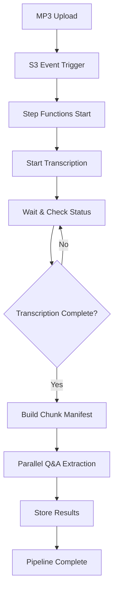

# 🎤 AI-Powered Interview Analysis Pipeline

A sophisticated serverless application that automatically processes interview recordings, extracts Q&A pairs, and scores candidate responses against job requirements using advanced AI models.

## 🚀 Overview

This AWS CDK-based application creates an end-to-end pipeline for analyzing technical interviews in Russian language. Upload an MP3 recording and get structured insights about the candidate's performance.

### ✨ Key Features

- **🎧 Audio Transcription**: High-quality Russian language transcription with custom technical vocabulary
- **🤖 AI-Powered Q&A Extraction**: Uses Amazon Bedrock (Claude 3.5 Haiku) to identify and extract question-answer pairs
- **📊 Intelligent Scoring**: Evaluates answers against job vacancy requirements
- **⚡ Scalable Processing**: Handles large 1-2 hour interviews through intelligent chunking
- **🔒 Enterprise Security**: End-to-end encryption with AWS KMS
- **💰 Cost-Optimized**: Smart model selection (Haiku for extraction, Sonnet for scoring)

## 🏗️ Architecture

```
┌─────────────┐    ┌──────────────┐    ┌─────────────────┐    ┌──────────────┐
│ S3 Upload   │───▶│ Step Functions│───▶│ Amazon Transcribe│───▶│ Bedrock AI   │
│ MP3 Files   │    │ Orchestration │    │ (Russian Lang)  │    │ Q&A Extract  │
└─────────────┘    └──────────────┘    └─────────────────┘    └──────────────┘
                           │                                           │
                           ▼                                           ▼
                   ┌──────────────┐                           ┌──────────────┐
                   │ DynamoDB     │◀──────────────────────────│ Answer       │
                   │ Results      │                           │ Scoring      │
                   └──────────────┘                           └──────────────┘
```

### 🧩 Components

- **S3 Bucket**: Stores interview recordings and vacancy descriptions
- **AWS Transcribe**: Converts Russian audio to text with speaker identification
- **Step Functions**: Orchestrates the entire workflow
- **Lambda Functions**: Process transcripts, extract Q&A, and score responses
- **DynamoDB**: Stores structured interview data and analysis results
- **Amazon Bedrock**: Powers AI-driven content extraction and scoring

## 📁 Project Structure

```
├── src/functions/          # Lambda function implementations
│   ├── transcribe_processor/    # Audio transcription with Russian optimization
│   ├── chunk_manifest_builder/  # Large transcript chunking
│   ├── chunked_qa_extractor/   # Q&A extraction from chunks
│   └── qa_extractor/           # Legacy Q&A extraction
├── stacks/                 # CDK infrastructure definitions
│   ├── kms_stack.py           # Encryption keys
│   ├── s3_interview.py        # Storage buckets
│   ├── dynamodb_stack.py      # Database tables
│   └── step_functions_stack.py # Workflow orchestration
└── utils/                  # Shared utilities and configuration
```

## 🎯 Use Cases

- **Technical Interviews**: Analyze coding and system design discussions
- **HR Screening**: Extract key competencies and responses
- **Interview Training**: Review and improve interviewing techniques
- **Compliance**: Maintain structured records of interview processes

## 🛠️ Quick Start

### Prerequisites

- AWS Account with Bedrock access
- Python 3.12+
- Poetry for dependency management
- AWS CDK v2

### Installation

```shell
# Clone and setup
git clone <repository>
cd workshop-serverless-applications-for-ai

# Install dependencies
poetry install

# Configure environment
export CDK_ACCOUNT=your-aws-account-id
export CDK_REGION=us-east-1
export CLOUD_ENVIRONMENT=workshop-dev

# Deploy infrastructure
cdk bootstrap --profile your-aws-profile
cdk deploy --all --profile your-aws-profile
```

## 📝 Usage

### 1. Prepare Interview Materials

```shell
# Upload vacancy description
aws s3 cp vacancy.txt s3://interview-artifacts/backend-developer/vacancy.txt

# Upload interview recording
aws s3 cp interview.mp3 s3://interview-artifacts/backend-developer/interview-123.mp3
```

### 2. Processing Pipeline

The system automatically:
1. **Detects** new MP3 uploads via S3 events
2. **Transcribes** audio using AWS Transcribe with Russian language optimization
3. **Chunks** large transcripts (1-2 hours) into manageable segments
4. **Extracts** Q&A pairs using Claude 3.5 Haiku
5. **Scores** answers against job requirements
6. **Stores** structured results in DynamoDB

### 3. Results Access

Query processed interviews from DynamoDB:
```python
# Get interview transcript
dynamodb.Table('interview_transcriptions').get_item(
    Key={'id': 'interview-123'}
)

# Get Q&A pairs with scores
dynamodb.Table('interview_qa').query(
    KeyConditionExpression='interview_id = :id',
    ExpressionAttributeValues={':id': 'interview-123'}
)
```

## 🔄 Processing Workflow



## 🌟 Advanced Features

### Russian Language Optimization
- Custom vocabulary for technical terms (программирование, алгоритм, API, etc.)
- Confidence-based transcript selection
- Speaker identification (Interviewer vs Candidate)

### Intelligent Chunking
- Handles 1-2 hour interviews efficiently
- 3-7 minute chunks with smart overlap
- Natural break point detection
- Preserves Q&A context boundaries

### Cost Optimization
- **Claude 3.5 Haiku**: Fast, cost-effective Q&A extraction
- **Claude 3.5 Sonnet**: High-quality answer scoring (when needed)
- Efficient chunking reduces processing costs

## 🛠️ Development

### Code Quality
```shell
# Lint code
poetry run flake8

# Format code
poetry run black .

# Run tests
poetry run pytest
```

### CDK Operations
```shell
# Synthesize templates
cdk synth

# Compare changes
cdk diff --all

# Deploy specific stack
cdk deploy WorkshopKmsStack

# Destroy resources
cdk destroy --all
```

## 📊 Monitoring & Observability

- **CloudWatch Logs**: Detailed function execution logs
- **Step Functions Console**: Visual workflow monitoring
- **DynamoDB Metrics**: Storage and query performance
- **Bedrock Usage**: AI model invocation tracking

## 🔐 Security

- **KMS Encryption**: All data encrypted at rest and in transit
- **IAM Roles**: Least privilege access principles
- **VPC Integration**: Optional network isolation
- **Bedrock Governance**: Controlled AI model access

## 💡 Technical Highlights

- **Serverless Architecture**: Pay-per-use, auto-scaling
- **Event-Driven**: Reactive processing pipeline
- **Microservices**: Loosely coupled Lambda functions
- **Infrastructure as Code**: CDK for reproducible deployments
- **Multi-Model AI**: Strategic model selection for optimal cost/performance

## 🤝 Contributing

1. Fork the repository
2. Create a feature branch
3. Follow code quality standards
4. Submit a pull request

## 📄 License

This project is licensed under the MIT License - see the LICENSE file for details.

---

*Built with ❤️ using AWS CDK, Python, and cutting-edge AI models* 
```